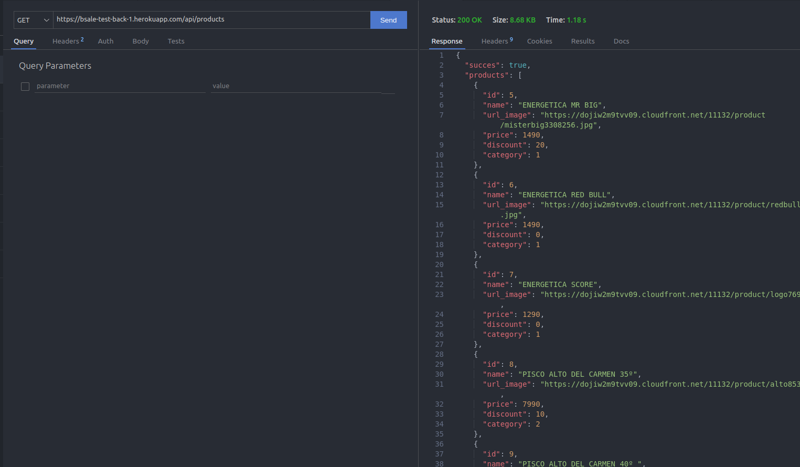
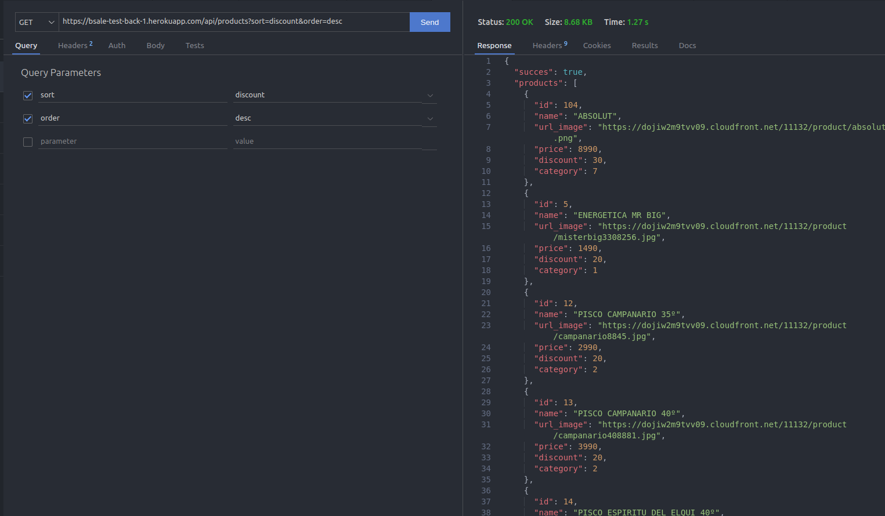
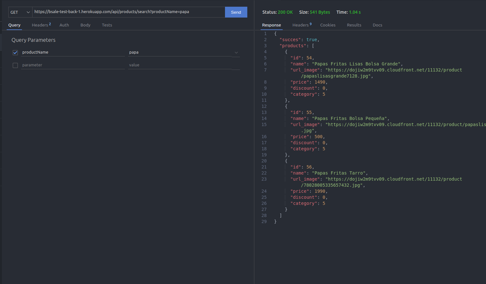
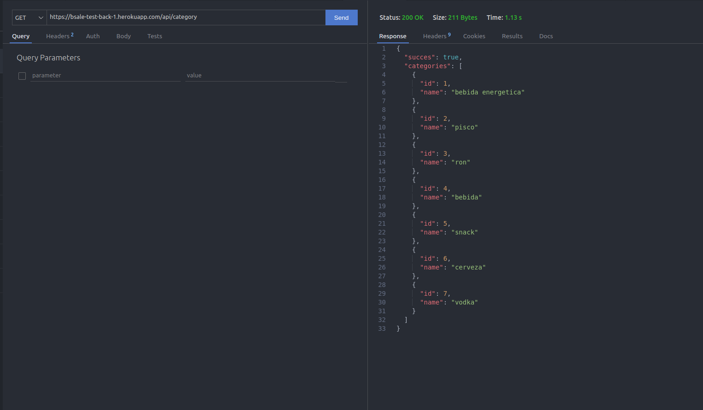
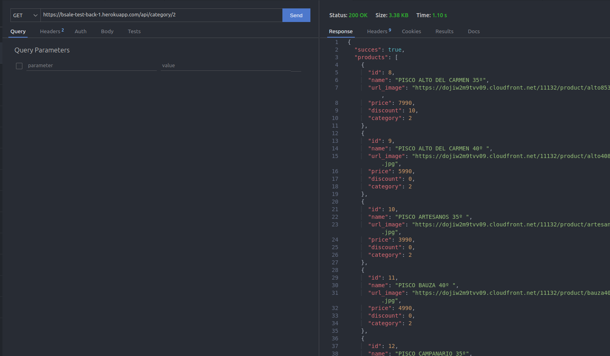
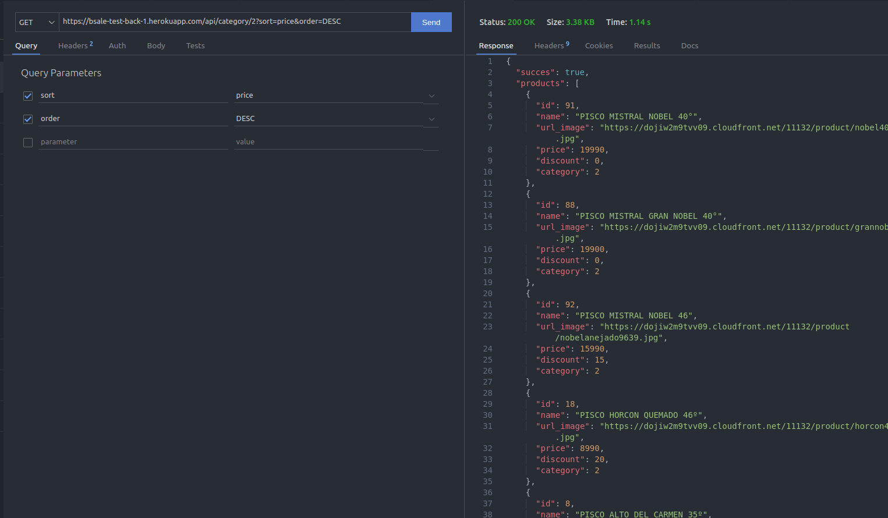

# Bsale-back

Backend api made with for the Bsale technical test.

## Made with

- [NodeJS](https://nodejs.org/)
- [ExpressJS](https://expressjs.com/)
- [Sequelize](https://sequelize.org/)
- [MySQL](https://www.mysql.com/)
- [Joi](https://joi.dev/)

## Deploy

Heroku ☞ https://bsale-test-back-1.herokuapp.com/

## DataBase

| PRODUCTS  |
| --------- |
| id        |
| name      |
| url_image |
| price     |
| discount  |
| category  |

| CATEGORY |
| -------- |
| id       |
| name     |

## Products Endpoints

`GET api/products/`

Get all products

`GET api/products?sort=attribute&order=order`

Get all product. Could be sorted by attribute on ASC or DESC order.

`GET api/products/search?productName=name`

Get products filter by name

## Category Endpoints

`GET api/category`

Get all categories.

`GET api/category/:categoryID`

Get products by category ID.

`GET api/category/:categoryID?sort=price&order=DESC`

Get products by category ID. Could be sorted by attribute on ASC or DESC order.

## Snips.

    Tech for Requests: ThunderClient

<p align='center'>GET ALL PRODUCTS</p>



<p align='center'>GEt ALL PRODUCTS SORTED</p>



<p align='center'>GET BY SEARCH PRODUCTS</p>



<p align='center'>GET CATEGORIES</p>



<p align='center'>GET PRODUCTS BY CATEGORY</p>



<p align='center'>GET PRODUCTS BY CATEGORY SORTED</p>



## Local execution

```
git clone https://github.com/Ezequiel-CE/bsale-test-back.git
cd bsale-test-back
npm install
create mysql database
add .env file with the database settings
npm start
```
